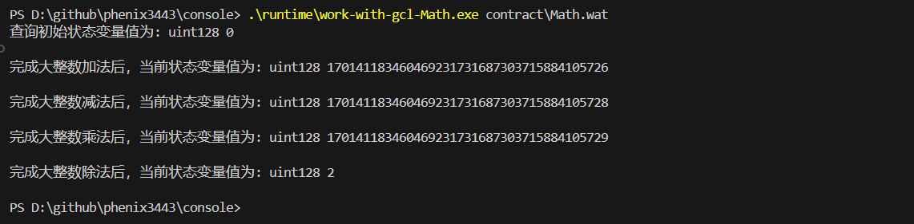

# windows 命令行执行流程

## 安装 GCL 工具链

[下载链接](https://kaasbuildpackages.s3.us-west-2.amazonaws.com/preda/gcl-toolchain-2407131136.exe)，默认安装位置`C:\Users\IDEA\AppData\Local\GCL\GCL_Dev_Environment\`

## 编译合约

将测试使用的 GCL 合约`Math.gcl`编译为包含标准 wasm 指令和 GCL 函数的 `wasm` 二进制文件，该文件默认位于`C:\Users\IDEA\AppData\Roaming\.gcl\chsimu_repo\wasm\bin\1_0000001400100001_Math.wasm`。

```sh
cd C:\Users\IDEA\AppData\Local\GCL\GCL_Dev_Environment\bin
.\chsimu.exe "d:\nuts\softwares\console\contract\Math.gclts" -count=4 -WASM -stdout
```

## 转译 WASM 代码

1. 将 wasm 二进制文件解析为可读的 wat 格式文件：

```sh
.\wabt-1.0.35\bin\wasm2c.exe C:\Users\IDEA\AppData\Roaming\.gcl\chsimu_repo\wasm\bin\1_0000001400100001_Math.wasm -o contract\1_0000001400100001_Math.wat --generate-names --enable-function-references
```

2. 转译器将 wat 文件中的 GCL 函数调用转译为课题二的 wasm 专用指令。

```sh
transpiler\transpiler.exe --config transpiler\config.yaml --input contract\1_0000001400100001_Math.wat --output contract\Math.wat
```

## 运行时执行

专用指令运行时加载 wat 文件执行

1. 安装 gcc

2. 将 `runtime\lib` 添加系统环境变量，注意可能需要重启系统。

3. 打开命令提示窗口。

4. 编译运行脚本

```sh
cd runtime\examples\work-with-gcl-i128add\
gcc -o work-with-gcl-i128add work-with-gcl-i128add.c -I../../include -L../../lib -lwasm-sc-runtime -Wl,-rpath,../../lib
```

5. 执行编译后的程序



## install gcc on windows

1. 安装 msys2, [下载链接](https://github.com/msys2/msys2-installer/releases/download/2024-05-07/msys2-x86_64-20240507.exe)

2. 使用 Pacman（MSYS2 的包管理器）安装 GCC，在 MSYS2 终端中，运行以下命令安装 GCC 工具链：

```sh
pacman -Syu
pacman -S mingw-w64-x86_64-toolchain

```

3. 将 GCC 添加到系统 PATH

要在任意命令提示符或 PowerShell 中使用 GCC，需要将 GCC 二进制文件的路径添加到系统 PATH 中。

对于 64 位系统，路径通常是 C:\msys64\mingw64\bin。
你可以通过进入“系统属性” -> “高级” -> “环境变量”，编辑 PATH 变量来添加此路径。
注意更改系统环境变量后可能需要重启系统才能生效。

4. 验证安装

打开新的命令提示符或 PowerShell 窗口，并输入以下命令：

```sh
gcc --version
```

这将显示 GCC 的版本信息，确认 GCC 已安装并可用。
